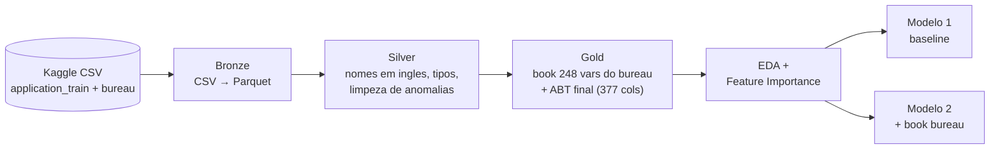

# Home Credit Default Risk — pipeline de dados + modelo de risco de crédito

Projeto de portfólio construído sobre a competição [Home Credit Default Risk](https://www.kaggle.com/competitions/home-credit-default-risk/overview) (Kaggle): um pipeline de dados completo (Bronze/Silver/Gold em PySpark) seguido de ciência de dados (EDA, seleção de variáveis, dois modelos comparados por AUC-ROC), testando uma hipótese de negócio concreta — **o histórico de crédito do cliente em outras instituições ajuda a prever inadimplência além do que a proposta atual já diz?**

Resposta curta: sim, um pouco, e de forma consistente entre as análises. Ver [Resultados](#resultados) abaixo.

## Índice

1. [`docs/01_entendimento_negocio.md`](docs/01_entendimento_negocio.md) — o problema de negócio (crédito, inadimplência, por que AUC-ROC)
2. [`docs/02_bronze.md`](docs/02_bronze.md) — ingestão bruta
3. [`docs/03_silver.md`](docs/03_silver.md) — nomenclatura, tipos, limpeza (inclui um bug real encontrado e corrigido)
4. [`docs/04_gold.md`](docs/04_gold.md) — book de 248 variáveis do bureau + ABT final (377 colunas)
5. [`docs/05_eda.md`](docs/05_eda.md) — análise exploratória
6. [`docs/06_feature_selection.md`](docs/06_feature_selection.md) — seleção de variáveis via XGBoost
7. [`docs/07_modelos.md`](docs/07_modelos.md) — Modelo 1 (baseline) vs. Modelo 2 (desafiante)
8. [`docs/08_arquitetura.md`](docs/08_arquitetura.md) — execução local vs. visão de arquitetura em nuvem

## O problema

A Home Credit empresta dinheiro pra gente com pouco ou nenhum histórico bancário — público historicamente mal atendido por bancos tradicionais e vulnerável a agiotagem. O desafio: aprovar quem vai pagar, sem aumentar demais a inadimplência nem excluir gente boa por falta de dado. Detalhe completo em [`docs/01_entendimento_negocio.md`](docs/01_entendimento_negocio.md).

## Pipeline de dados (Bronze → Silver → Gold)



Executado localmente em PySpark (ambiente equivalente a um Colab). A visão de como essa mesma arquitetura ficaria em nuvem (S3/ADLS + Databricks/EMR + Delta Lake + MLflow) está em [`docs/08_arquitetura.md`](docs/08_arquitetura.md).

## Resultados

| Modelo | Features | AUC-ROC (validação) |
|---|---|---|
| 1 — baseline | 126 (só `application_train`) | 0,759 |
| 2 — desafiante | 375 (+ book do bureau) | **0,768** |

O ganho de ~1 ponto de AUC vem só de adicionar o resumo do histórico de crédito em outras instituições — mesmos hiperparâmetros, mesmo split, isolando essa única variável. Bate com a análise de Feature Importance: **10 das 30 variáveis mais importantes do modelo combinado vêm do book do bureau**, incluindo a 3ª colocada geral. Detalhes em [`docs/06_feature_selection.md`](docs/06_feature_selection.md) e [`docs/07_modelos.md`](docs/07_modelos.md).


## Decisões de engenharia (e um erro corrigido)

Este projeto rodou num ambiente local com recurso limitado (2 vCPU / ~2,8GB RAM) — isso obrigou a decisões reais, todas documentadas no lugar onde aconteceram, não escondidas:

- **Um bug de verdade, pego e corrigido**: a limpeza inicial da Silver zerou duas colunas (`owns_car`, `owns_realty`) por tratar um `'Y'/'N'` como se fosse `0/1`. Pego durante a EDA, corrigido no código, documentado em [`docs/03_silver.md`](docs/03_silver.md).
- **Join da camada Gold**: o join final (Spark e pandas, cada um na sua tentativa) estourou memória com a base inteira de uma vez. Resolvido processando em lotes (chunks) — decisão documentada em [`docs/04_gold.md`](docs/04_gold.md).
- **Seleção de variáveis**: o ranking de importância sobre a ABT completa (375 colunas) rodou com amostra de 150 mil linhas por limite de tempo/memória do ambiente de demonstração; os modelos finais (baseline e desafiante) usam a base inteira. Ver [`docs/06_feature_selection.md`](docs/06_feature_selection.md).

## Como reproduzir

```bash
pip install -r requirements.txt

# Bronze
spark-submit src/bronze_ingest.py --raw-dir data/raw --bronze-dir data/bronze

# Silver
spark-submit src/silver_transform.py --bronze-dir data/bronze --silver-dir data/silver

# Gold (book do bureau, em estagios) + ABT
spark-submit src/gold_build.py --stage meta
spark-submit src/gold_build.py --stage all
spark-submit src/gold_build.py --stage active
spark-submit src/gold_build.py --stage closed
spark-submit src/gold_build.py --stage cats
python3 src/gold_join.py --silver-dir data/silver --stage-dir data/gold_stage --gold-dir data/gold

# Feature importance
python3 src/feature_selection.py --which app_only
python3 src/feature_selection.py --which full_abt

# Modelos
python3 src/model1_baseline.py --silver-dir data/silver --out-dir models
python3 src/model2_challenger.py --step split --gold-dir data/gold --split-out-dir data/gold_stage
python3 src/model2_challenger.py --step train --data-dir data/gold_stage --models-dir models
```

## Estrutura

```
data/raw/          CSVs originais do Kaggle (nao versionado, ver .gitignore)
src/               scripts do pipeline (bronze, silver, gold, feature selection, modelos)
docs/              entendimento de negocio + documentacao de cada etapa
models/            metricas dos modelos (AUC, params)
reports/figures/   graficos da EDA, feature importance e comparacao dos modelos
requirements.txt
```

## Stack

PySpark (Bronze/Silver/Gold), pandas + XGBoost (feature engineering final, seleção de variáveis, modelos), scikit-learn (split, métricas).
