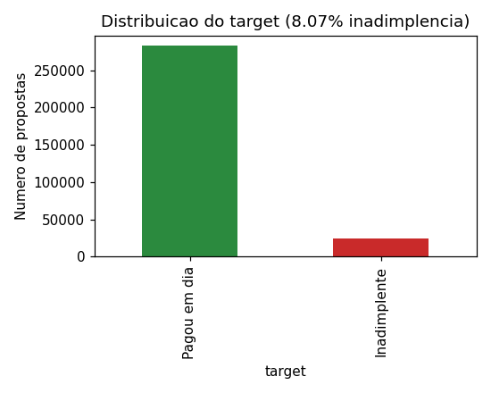
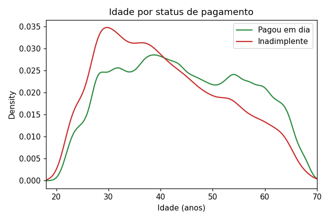
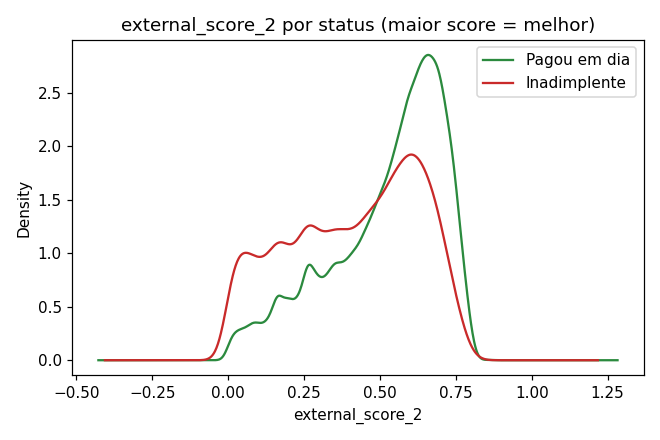
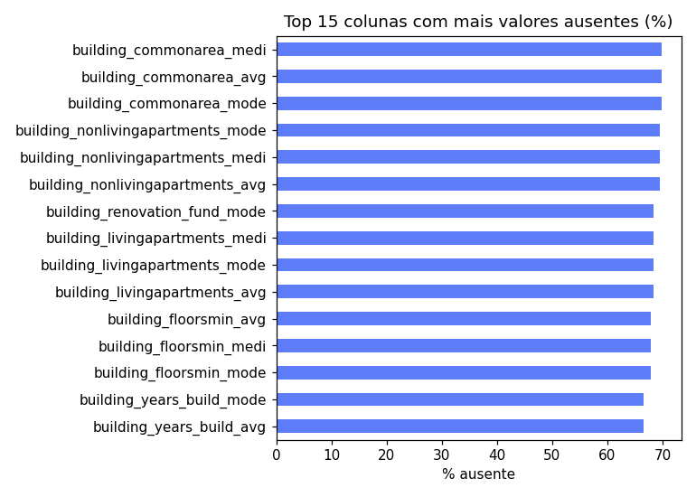
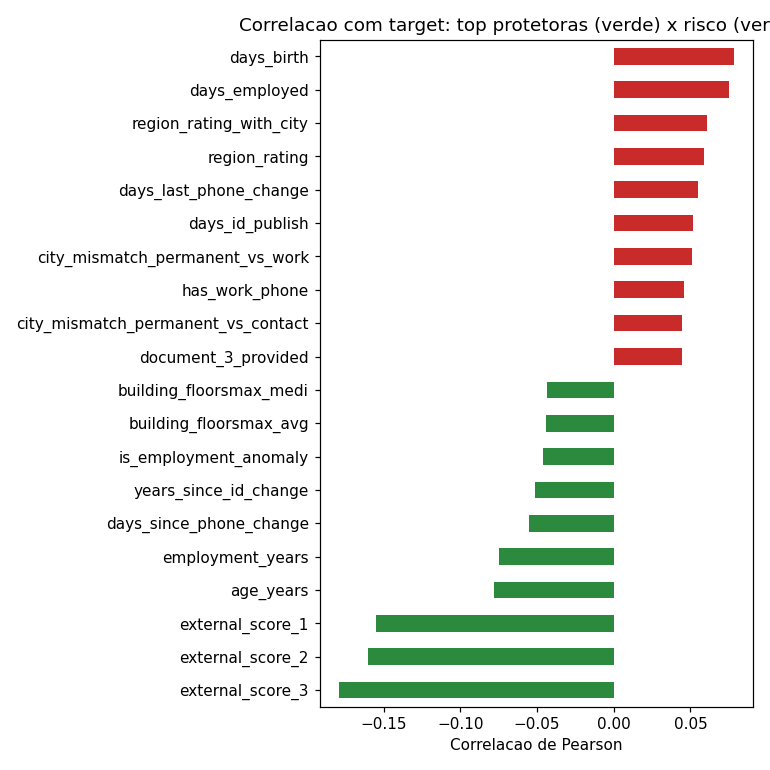

# 5. EDA — application_train

Base: `application_train` (silver, corrigida), 307.511 propostas, 128 colunas.

## Target

- **8,07% de inadimplência** (24.825 de 307.511). Confirma o número publicamente conhecido desse dataset — mais uma checagem de integridade do pipeline.
- Dataset desbalanceado ~11:1 — reforça a escolha de AUC-ROC como métrica (ver `docs/01_entendimento_negocio.md`), já que acurácia simples seria enganosa aqui (um modelo que só chuta "paga" já acerta 92%).

## Um bug pego aqui: `owns_car` / `owns_realty`

Durante a EDA, `owns_car` e `owns_realty` apareceram 100% nulos — bug na camada Silver (essas duas colunas vêm como `'Y'/'N'` no Kaggle, diferente dos outros `FLAG_*`, que são `0/1`; o cast tratava todas igual). Corrigido em `src/silver_transform.py` e documentado em `docs/03_silver.md`. Todos os números abaixo já refletem a versão corrigida.

## Valores ausentes

56 das 128 colunas não têm nenhum valor ausente. O grosso do missing está nas colunas `building_*` (informação normalizada sobre o prédio onde o cliente mora — até ~70% ausente), o que faz sentido de negócio: quem não é dono do imóvel (aluga, mora com os pais) naturalmente não tem esse dado preenchido. Ver `docs/feature_dictionary.csv`/gráfico `04_missing_top15.png`.

## Perfil da base (variáveis-chave)

| Variável | Média | Mediana | Min | Max |
|---|---|---|---|---|
| Idade (anos) | 43,9 | 43,1 | 20,5 | 69,1 |
| Anos de emprego | 6,5 | 4,5 | 0 | 49 |
| Renda total | 168.798 | 147.150 | 25.650 | 117.000.000 |
| Valor do crédito | 599.026 | 513.531 | 45.000 | 4.050.000 |
| Valor da parcela (anuidade) | 27.109 | 24.903 | 1.616 | 258.255 |

**Nota**: `total_income` tem outlier extremo (máximo de 117 milhões, ~700x a mediana). O percentil 99,9 já cai pra 900 mil — vale tratar esse outlier (winsorização ou log) antes de usar `total_income` bruto em qualquer modelo linear; modelos baseados em árvore (Random Forest, XGBoost, usados nas próximas etapas) são naturalmente mais robustos a isso.

## Taxa de inadimplência por segmento (bivariada)

- **Gênero**: homens 10,1% vs. mulheres 7,0%.
- **Educação**: cai conforme aumenta o nível — de 10,9% (fundamental incompleto) até 1,8% (doutorado, n pequeno).
- **Tipo de renda**: "Maternity leave" e "Unemployed" aparecem com taxa altíssima (36-40%), mas com **n muito pequeno** (5 e 22 casos) — não é um sinal estatisticamente confiável, é ruído de amostra pequena. As categorias com volume relevante (Working, Commercial associate, State servant, Pensioner) mostram um padrão mais sólido: quem trabalha por conta ("Working") tem taxa maior (9,6%) que aposentados (5,4%).
- **Tipo de habitação**: quem aluga ou mora com os pais tem taxa maior (11-12%) que quem tem casa própria (7,8%).
- **Tipo de contrato**: empréstimo parcelado ("Cash loans") é mais arriscado (8,4%) que rotativo ("Revolving loans", 5,5%).

## Correlação com o target

As variáveis mais correlacionadas (em módulo) com o target são os **três scores externos** (`external_score_1/2/3`, fontes de dados de terceiros) — todas negativas (score mais alto = menos risco), consistente com o que é publicamente conhecido sobre esse dataset: são, de longe, os melhores preditores individuais disponíveis em `application_train`. Idade e tempo de emprego também protegem (quanto maior, menor o risco). Ver gráfico `05_correlation_top20.png`.

Isso já antecipa o resultado esperado da etapa de seleção de variáveis (Feature Importance): os scores externos devem liderar o ranking, tanto no modelo baseline quanto no desafiante.

## Gráficos

