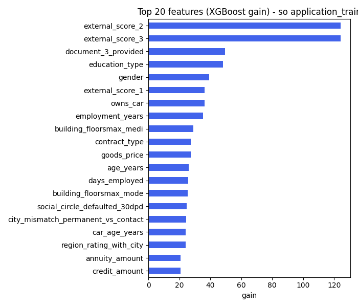
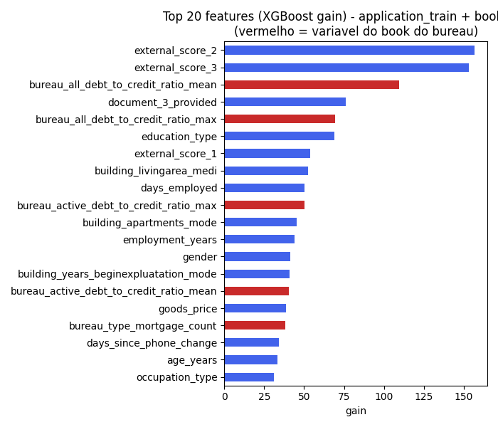

# 6. Seleção de variáveis — Feature Importance (XGBoost)

Método: XGBoost (`tree_method=hist`, suporte nativo a categórica e a nulo — não precisei imputar nada), importância por **gain** (ganho médio de impureza que a variável traz quando usada nos splits — mais informativo que "número de vezes usada" para decidir quais variáveis carregam sinal de negócio real). Script: [`src/feature_selection.py`](../src/feature_selection.py).

Rodei duas vezes, pra comparar:

## 1. Só `application_train` (126 features)

AUC de validação (holdout 20%): **0,759**.

Top 10:

| # | Variável | Gain |
|---|---|---|
| 1 | external_score_2 | 124,3 |
| 2 | external_score_3 | 124,3 |
| 3 | document_3_provided | 49,3 |
| 4 | education_type | 48,0 |
| 5 | gender | 39,1 |
| 6 | external_score_1 | 36,3 |
| 7 | owns_car | 36,3 |
| 8 | employment_years | 35,2 |
| 9 | building_floorsmax_medi | 29,0 |
| 10 | contract_type | 27,3 |

Os três scores externos (fontes de terceiros) dominam, como já indicava a correlação simples na EDA. `document_3_provided` (se o cliente entregou o documento 3) aparecer em 3º é curioso — vale investigar se é sinal de negócio real ou proxy de outra coisa (ex.: tipo de canal de venda), mas está fora do escopo desta etapa.

## 2. `application_train` + book do bureau (ABT completa, 375 features)

AUC de validação (holdout 20%, amostra de 150 mil linhas — ver nota de amostragem abaixo): **0,763**.

Top 15:

| # | Variável | Gain | Origem |
|---|---|---|---|
| 1 | external_score_2 | 157,0 | application |
| 2 | external_score_3 | 153,1 | application |
| 3 | **bureau_all_debt_to_credit_ratio_mean** | 109,6 | **bureau book** |
| 4 | document_3_provided | 76,3 | application |
| 5 | **bureau_all_debt_to_credit_ratio_max** | 69,6 | **bureau book** |
| 6 | education_type | 68,8 | application |
| 7 | external_score_1 | 53,6 | application |
| 8 | building_livingarea_medi | 52,4 | application |
| 9 | days_employed | 50,4 | application |
| 10 | **bureau_active_debt_to_credit_ratio_max** | 50,1 | **bureau book** |
| 11 | building_apartments_mode | 45,5 | application |
| 12 | employment_years | 44,0 | application |
| 13 | gender | 41,2 | application |
| 14 | building_years_beginexpluatation_mode | 40,8 | application |
| 15 | **bureau_active_debt_to_credit_ratio_mean** | 40,4 | **bureau book** |

**10 das 30 variáveis mais importantes vêm do book do bureau** — e a 3ª variável mais importante do modelo inteiro (`bureau_all_debt_to_credit_ratio_mean`, a proporção média de dívida sobre crédito tomado em outras instituições) é do book, ficando logo atrás dos dois scores externos. Isso é o resultado central da "história" do projeto: o histórico de crédito em outras instituições carrega sinal preditivo que o `application_train` sozinho não tem.

## Nota de amostragem (transparência)

A versão "full ABT" (375 colunas) foi treinada com uma amostra aleatória estratificada de 150 mil das 307 mil linhas — no ambiente local de demonstração (2 vCPU / ~2,8GB RAM), treinar com a base inteira nessa largura não coube no tempo/memória disponíveis nesta etapa específica (ranking de importância). O ranking de importância é estável com esse tamanho de amostra; os **modelos finais (baseline e desafiante) usam a base inteira** (ver `docs/07_modelos.md`).

## Gráficos

