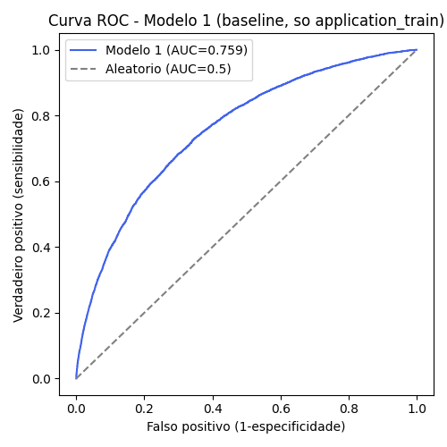
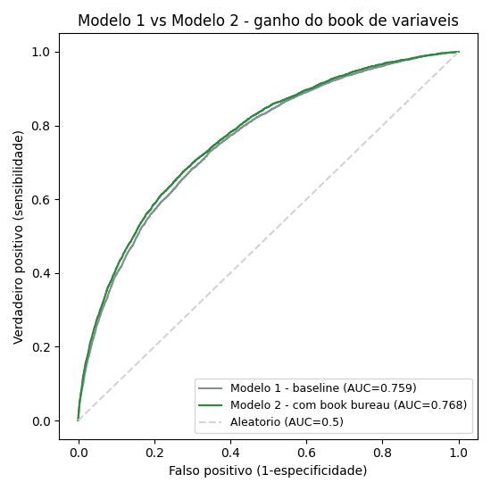

# 7. Modelos — baseline vs. desafiante

Os dois modelos usam o mesmo algoritmo (XGBoost) e a mesma metodologia de avaliação (holdout 80/20 estratificado, `random_state=42`), pra isolar uma única variável: **entra ou não o book de variáveis do bureau**. Isso é o que torna a comparação de AUC-ROC entre os dois válida como "efeito do book", e não só "efeito de ter mudado os hiperparâmetros junto".

## Modelo 1 — baseline (`src/model1_baseline.py`)

- **Features**: só `application_train` (silver), 126 variáveis. Nenhuma informação do bureau.
- **Split**: 80% treino / 20% validação, estratificado por `target`.
- **AUC-ROC**: **0,759** na validação (0,80 no treino — gap pequeno, sem sinal de overfitting grave).

Este número é a régua: qualquer coisa que o Modelo 2 ganhar acima de 0,759 é atribuível ao histórico de crédito em outras instituições, não a mágica de hiperparâmetro.



## Modelo 2 — desafiante (`src/model2_challenger.py`)

- **Features**: `application_train` + as 248 variáveis do book do bureau (ABT completa), 375 variáveis.
- **Split**: idêntico ao Modelo 1 (80/20 estratificado, `random_state=42` — os mesmos clientes caem em treino/validação nos dois modelos).
- **Hiperparâmetros**: idênticos ao Modelo 1 (150 árvores, profundidade 5, learning rate 0,08) — a única coisa que muda entre os dois modelos são as colunas de entrada.
- **AUC-ROC**: **0,768** na validação (0,816 no treino).

## Resultado — o ganho do book de variáveis

| Modelo | Features | AUC-ROC (validação) |
|---|---|---|
| 1 — baseline | 126 (só application_train) | 0,759 |
| 2 — desafiante | 375 (+ book do bureau) | **0,768** |

**Ganho de +0,0095 de AUC** (~1 ponto percentual) só de adicionar o histórico de crédito em outras instituições, sem mudar nenhum hiperparâmetro. Não é um salto gigantesco, mas é real, consistente com o que a análise de Feature Importance já apontava (3 das 15 variáveis mais importantes do modelo combinado vêm do book do bureau, incluindo a 3ª colocada geral) e é o tipo de ganho que, em produção, se traduz em menos crédito ruim aprovado / menos crédito bom recusado — a decisão de negócio que este projeto inteiro existe para embasar (ver `docs/01_entendimento_negocio.md`).



## Como reproduzir

```bash
python3 src/model1_baseline.py --silver-dir data/silver --out-dir models

python3 src/model2_challenger.py --step split --gold-dir data/gold --split-out-dir data/gold_stage
python3 src/model2_challenger.py --step train --data-dir data/gold_stage --models-dir models
```
