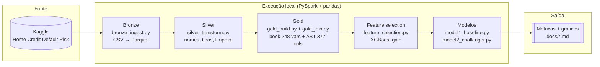
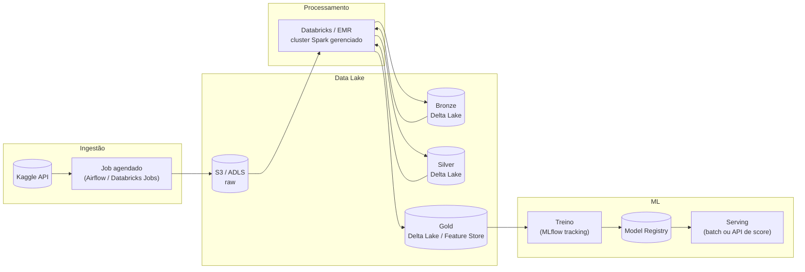

# 8. Arquitetura — execução local vs. visão em nuvem

Os diagramas abaixo usam Mermaid (renderizado nativamente pelo GitHub). O pipeline foi **executado localmente** (ambiente equivalente a rodar num Colab); a segunda seção descreve como a mesma arquitetura Bronze/Silver/Gold ficaria hospedada em nuvem, caso o projeto fosse para produção.

## Como rodou (local, este projeto)

## Como ficaria em nuvem (visão de arquitetura)

## O que muda de fato

O pipeline lógico (Bronze → Silver → Gold → features → modelo) é **o mesmo** nos dois cenários — isso é deliberado, é o ponto do exercício. O que muda é só a camada de infraestrutura:

| | Local (este projeto) | Nuvem |
|---|---|---|
| Armazenamento | disco local / parquet no sandbox | S3 ou ADLS + Delta Lake (versionamento, ACID, time travel) |
| Processamento | PySpark `local[*]` (2 vCPU) | Cluster gerenciado (Databricks/EMR), escala sob demanda |
| Orquestração | scripts rodados manualmente, em ordem | Airflow / Databricks Jobs, agendado, com retry e alerta de falha |
| Rastreio de experimento | `models/*_metrics.json` manual | MLflow (ou similar), comparação automática entre execuções |
| Deploy do modelo | nenhum (projeto de portfólio) | Model Registry + endpoint de score (batch ou tempo real) |

A limitação de recurso do ambiente local (2 vCPU / ~2,8GB RAM) obrigou a algumas decisões de engenharia documentadas ao longo do projeto (join do Gold em chunks — `docs/04_gold.md`; amostragem na seleção de variáveis — `docs/06_feature_selection.md`; split-then-train do Modelo 2 — `docs/07_modelos.md`). Em nuvem, com um cluster de verdade, nenhuma dessas quebras manuais seria necessária — mas documentar o porquê delas aqui é, em si, parte do que se espera de alguém que vai operar esse tipo de pipeline em produção: reconhecer o limite do ambiente e adaptar sem quebrar o resultado.
